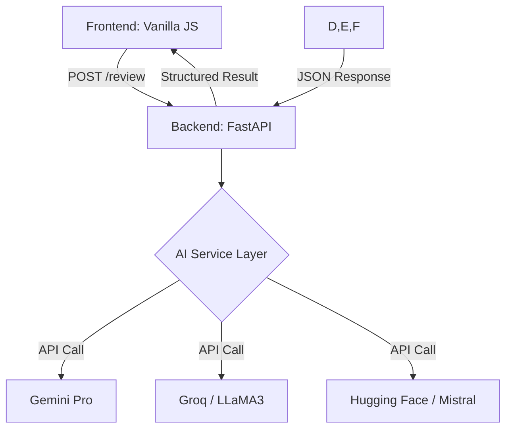

# CodeRefine – Generative AI–Powered Code Review Engine

CodeRefine is a production-quality, hackathon-optimized code review and optimization engine. It leverages state-of-the-art LLMs (Gemini, Groq, Hugging Face) to provide senior-engineer-level feedback on source code.

## 🚀 Features
- **Senior AI Reviewer**: Identifies bugs, code smells, and performance bottlenecks.
- **Multi-Model Support**: Switch between Gemini Pro, Groq (LLaMA3), and Hugging Face.
- **Quality Scoring**: Quantitative assessment (1-10) of your code.
- **Explanation Mode**: Toggle between technical and beginner-friendly breakdowns.
- **Code Optimization**: Get instantly refactored, best-practice code versions.
- **Language Detection**: Automatically infers the programming language.

## 🛠 Tech Stack
- **Backend**: FastAPI (Python)
- **Frontend**: Vanilla JS, HTML5, Tailwind CSS
- **AI Models**: Google Gemini, Groq (Llama 3), Hugging Face (Mistral)
- **Infrastructure**: RESTful API, Pydantic for validation

## 🏗 Architecture


## 🪜 How to Run
1. **Clone the project** to your local environment.
2. **Install dependencies**:
   ```bash
   pip install -r requirements.txt
   ```
3. **Configure API Keys**:
   - Create a `.env` file in the root based on `.env.template`.
   - Add your API keys for Gemini, Groq, or Hugging Face.
4. **Start the server**:
   ```bash
   python -m app.main
   ```
5. **Open your browser**:
   Navigate to `http://localhost:8000`.

## 🔮 Future Scope
- **Git Integration**: Automated PR reviews via GitHub Actions.
- **Interactive Chat**: Ask the AI follow-up questions about the review.
- **Custom Rulebooks**: Define specific team-based linting rules for the AI to follow.
- **IDE Extensions**: VS Code and JetBrains plugins.
